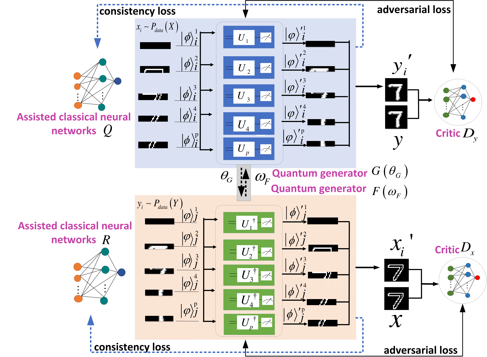

# iHQGAN: A Lightweight Invertible Hybrid Quantum-Classical Generative Adversarial Network for Unsupervised Image-to-Image Translation,2024

This repository is the implementation of [iHQGAN: A Lightweight Invertible Hybrid Quantum-Classical Generative Adversarial Network for Unsupervised Image-to-Image Translation](https://arxiv.org/abs/2411.13920).

Leveraging quantum computing’s intrinsic properties to enhance machine learning has shown promise, with quantum generative adversarial networks (QGANs) demonstrating benefits in data generation. However, the application of QGANs to complex unsupervised image-to-image (I2I) translation remains unexplored. Moreover, classical neural networks often suffer from large parameter spaces, posing challenges for GAN-based I2I methods. Inspired by the fact that unsupervised I2I translation is essentially an approximate reversible problem, we propose a lightweight invertible hybrid quantum-classical unsupervised I2I translation model — iHQGAN, by harnessing the invertibility of quantum computing. Specifically, iHQGAN employs two mutually approximately reversible quantum generators with shared parameters, effectively reducing the parameter scale. To ensure content consistency between generated and source images, each quantum generator is paired with an assisted classical neural network (ACNN), enforcing a unidirectional cycle consistency constraint between them. Simulation experiments were conducted on 19 sub-datasets across three tasks. Qualitative and quantitative assessments indicate that iHQGAN effectively performs unsupervised I2I translation with excellent generalization and can outperform classical methods that use low-complexity CNN-based generators. Additionally, iHQGAN, as with classical reversible methods, reduces the parameter scale of classical irreversible methods via a reversible mechanism. This study presents the first versatile quantum solution for unsupervised I2I translation, extending QGAN research to more complex image generation scenarios and offering a quantum approach to decrease the parameters of GAN-based unsupervised I2I translation methods. 

[Paper](https://arxiv.org/abs/2411.13920)

### The framework of iHQGAN

The overall architecture of iHQGAN. iHQGAN consists of two quantum generators, two assisted classical networks (ACNNs), and two classical critics. The quantum generators $G$ and $F$ comprise $p$ sub-quantum generators. ACNNs are utilized to achieve consistency loss, while the critics implement adversarial loss.During the alternating training of the two quantum generators, their respective parameters $\theta_G$ and $\omega_F$ are interchangeably assigned to facilitate parameter sharing.

|                   The framework of iHQGAN                    |
| :----------------------------------------------------------: |
|  |

Please refer to our [paper](https://arxiv.org/pdf/2411.13920) for more details.

## Experiment Results 

|                      *Edge  Detection*                       |
| :----------------------------------------------------------: |
|  |
|                   *Font  Style  Transfer*                    |
|  |
|                       *Image Denosing*                       |
|  |

## Requirements

- Python v3.10 or higher
- Pytorch v1.8 or higher
- Pennylane v0.35.1 or higher
- Tqdm v4.66.1 or higher
- Torch  v2.1.2 or higher
- Torchvision  v0.16.2 or higher
- Numpy v1.26.4 or higher


## Dataset 

The dataset construction  are in this  rpositories.

## Training

Train the iHQGAN

```python
python main_iHQGAN.py
```

## Citing our work

Please cite the following papers if you use our code:

```latex
@misc{yang2024ihqganlightweightinvertiblehybrid,
      title={iHQGAN: A Lightweight Invertible Hybrid Quantum-Classical Generative Adversarial Network for Unsupervised Image-to-Image Translation}, 
      author={Xue Yang and Rigui Zhou and ShiZheng Jia and YaoChong Li and Jicheng Yan and ZhengYu Long and Wenyu Guo and Fuhui Xiong and Wenshan Xu},
      year={2024},
      eprint={2411.13920},
      archivePrefix={arXiv},
      primaryClass={quant-ph},
      url={https://arxiv.org/abs/2411.13920}, 
}
```

 
